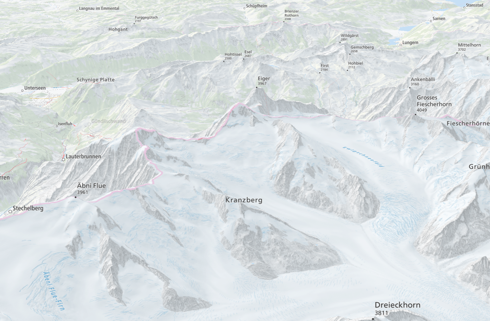

# maplibre-terrain3d
Demo of the upcoming MapLibre GL JS Terrain 3D feature

Your feedback is welcome at https://github.com/maplibre/maplibre-gl-js/pull/1022

Live [Demo](https://wipfli.github.io/maplibre-terrain3d/#11.49/46.4444/8.0585/10.4/66):

Live [Demo Swisstopo](https://wipfli.github.io/maplibre-terrain3d/swisstopo.html):

[Fly to Demo](https://wipfli.github.io/maplibre-terrain3d/flyto.html)
